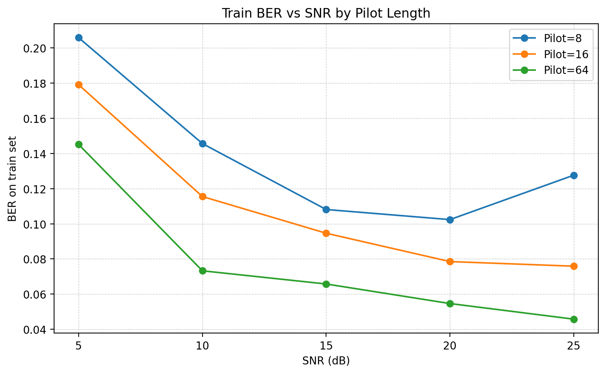
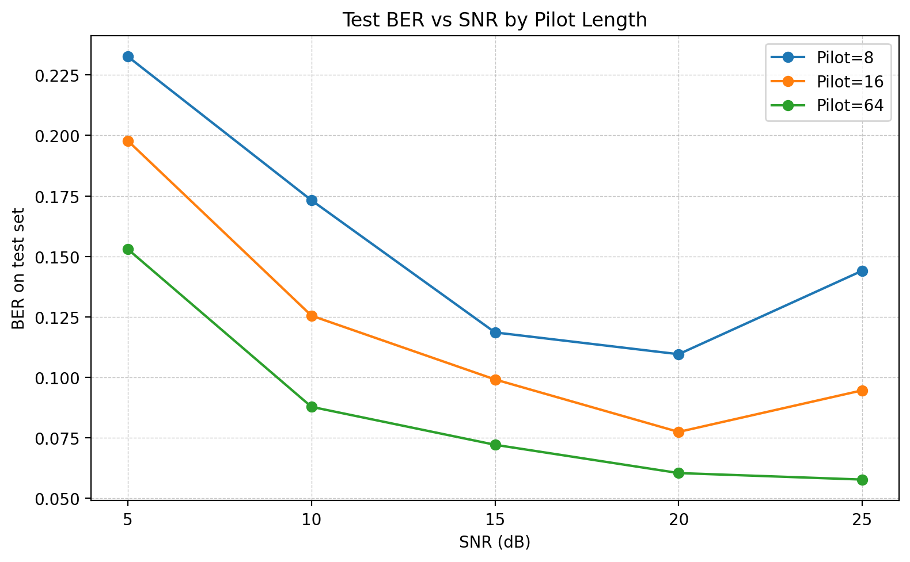

# Exercise 3.1(b) — FC-DNN OFDM Detection BER Reproduction

This repository records the simulation result for **Exercise 3.1(b)**.  
The goal of this experiment is to reproduce the BER trend of a learning-based OFDM signal detector by sweeping the SNR and the number of pilot subcarriers.

## 1. System Setup

The simulated OFDM system uses the following configuration:

| Item | Setting |
|---|---|
| OFDM subcarriers | 64 |
| Modulation | QPSK |
| Bits per subcarrier | 2 |
| Bits per OFDM data symbol | 128 |
| DNN input size | 256 |
| DNN output size | 16 |
| Pilot lengths | 8, 16, 64 |
| SNR values | 5, 10, 15, 20, 25 dB |
| Channel dataset | `H_dataset` from `haoyye/OFDM_DNN` |
| Metric | Bit Error Rate (BER) |

The FC-DNN input is formed by concatenating the real and imaginary parts of the received pilot OFDM symbol and the received data OFDM symbol. Since each received OFDM symbol has 64 complex samples, the input dimension is:

```text
64 × 2 × 2 = 256
```

For QPSK, each OFDM data symbol has:

```text
64 subcarriers × 2 bits = 128 bits
```

Following the original FC-DNN design, one DNN predicts only one segment of the full bit vector. Therefore, each DNN outputs:

```text
128 / 8 = 16 bits
```

The network architecture used in this experiment is:

```text
256 → 500 → 250 → 120 → 16
```

## 2. Main Code Modifications

The original GitHub code required several modifications before running correctly on the current Windows + TensorFlow 2.x environment.

### 2.1 TensorFlow compatibility

The code was modified to use TensorFlow 1.x compatibility mode:

```python
import tensorflow.compat.v1 as tf
tf.disable_v2_behavior()
```

This is required because the original implementation uses TensorFlow 1.x APIs such as `tf.placeholder`, `tf.Session`, and `tf.train.RMSPropOptimizer`.

### 2.2 Dataset path

The `H_dataset` was downloaded from:

```text
https://github.com/haoyye/OFDM_DNN
```

and placed under:

```text
Exercise_3.1/H_dataset/
```

The training code reads:

```text
1.txt ~ 300.txt      for training
301.txt ~ 400.txt    for testing
```

### 2.3 SNR and pilot sweep

The `Main.py` file was modified to automatically sweep the SNR and pilot length:

```python
snr_list = [5, 10, 15, 20, 25]
pilot_list = [8, 16, 64]

for P in pilot_list:
    for snr in snr_list:
        config.Pilots = P
        config.SNR = snr
        train(config)
```

This produces 15 training/testing runs in total.

### 2.4 Pilot length bug fix

When `P < 64`, the original code may try to assign 64 pilot values into only 8 or 16 pilot subcarriers.  
The pilot assignment was modified as:

```python
OFDM_data[pilotCarriers] = pilotValue[:len(pilotCarriers)]
```

This allows the same simulation flow to support `P = 8`, `P = 16`, and `P = 64`.

### 2.5 Training length reduction

The original code uses a very large training loop. For this experiment, the training length was reduced to make the simulation practical:

```python
traing_epochs = 100
total_batch = 5
for index_k in range(0, 500):
    ...
```

The final BER was recorded from the last displayed epoch. Since `display_step = 5`, the last reported BER appears at epoch 96 when running 100 epochs.

## 3. BER Results

### 3.1 Raw BER table

| SNR (dB) | Pilot Length | Test BER | Train BER |
|---:|---:|---:|---:|
| 5 | 8 | 0.232562 | 0.205875 |
| 10 | 8 | 0.173188 | 0.145625 |
| 15 | 8 | 0.118563 | 0.108125 |
| 20 | 8 | 0.109563 | 0.102375 |
| 25 | 8 | 0.144063 | 0.127625 |
| 5 | 16 | 0.197750 | 0.179125 |
| 10 | 16 | 0.125500 | 0.115500 |
| 15 | 16 | 0.099125 | 0.094625 |
| 20 | 16 | 0.077438 | 0.078500 |
| 25 | 16 | 0.094625 | 0.075875 |
| 5 | 64 | 0.152937 | 0.145125 |
| 10 | 64 | 0.087812 | 0.073250 |
| 15 | 64 | 0.072125 | 0.065750 |
| 20 | 64 | 0.060438 | 0.054625 |
| 25 | 64 | 0.057750 | 0.045750 |

### 3.2 Test BER by pilot length

| SNR (dB) | Pilot=8 | Pilot=16 | Pilot=64 |
|---:|---:|---:|---:|
| 5 | 0.232562 | 0.197750 | 0.152937 |
| 10 | 0.173188 | 0.125500 | 0.087812 |
| 15 | 0.118563 | 0.099125 | 0.072125 |
| 20 | 0.109563 | 0.077438 | 0.060438 |
| 25 | 0.144063 | 0.094625 | 0.057750 |

### 3.3 Train BER by pilot length

| SNR (dB) | Pilot=8 | Pilot=16 | Pilot=64 |
|---:|---:|---:|---:|
| 5 | 0.205875 | 0.179125 | 0.145125 |
| 10 | 0.145625 | 0.115500 | 0.073250 |
| 15 | 0.108125 | 0.094625 | 0.065750 |
| 20 | 0.102375 | 0.078500 | 0.054625 |
| 25 | 0.127625 | 0.075875 | 0.045750 |

## 4. Result Figures

### Train BER



### Test BER



## 5. Result Analysis

### 5.1 Effect of SNR

For all pilot lengths, BER generally decreases as SNR increases from 5 dB to 20 dB.  
This is expected because a higher SNR means lower additive noise power, so the received OFDM samples contain clearer information for the DNN detector.

For example, with `Pilot=64`, the test BER decreases from:

```text
0.1529 at 5 dB → 0.0577 at 25 dB
```

This is the most stable trend among the three pilot settings.

### 5.2 Effect of pilot length

The result clearly shows that using more pilots improves detection performance.  
At the same SNR, `Pilot=64` consistently achieves the lowest BER, followed by `Pilot=16`, while `Pilot=8` gives the highest BER.

For example, at 20 dB:

```text
Pilot=8:   test BER = 0.1096
Pilot=16:  test BER = 0.0774
Pilot=64:  test BER = 0.0604
```

This is reasonable because more pilot subcarriers provide more channel-related information to the DNN receiver.

### 5.3 Non-monotonic behavior at high SNR

For `Pilot=8` and `Pilot=16`, the BER increases at 25 dB compared with 20 dB:

```text
Pilot=8:   0.1096 at 20 dB → 0.1441 at 25 dB
Pilot=16:  0.0774 at 20 dB → 0.0946 at 25 dB
```

This is not the ideal theoretical trend. Possible reasons include:

1. **Training time is shortened**: only 100 epochs were used, so the model may not have fully converged for every SNR/pilot setting.
2. **Stochastic training variation**: the training samples are randomly generated in every epoch.
3. **Small test set variation**: the final BER is estimated from the testing samples generated at the displayed epoch.
4. **Different models trained separately**: each SNR/pilot pair trains a new DNN, so the resulting BER curve may contain training randomness.

Since `Pilot=64` still shows a smooth decreasing trend, the overall result is still consistent with the expected behavior.

## 6. Conclusion

The reproduced simulation results show the expected main trends:

1. Increasing SNR generally reduces BER.
2. Increasing the number of pilots improves the FC-DNN detector performance.
3. `Pilot=64` provides the most stable and lowest BER across all SNR values.
4. The train/test BER gap is small, indicating no severe overfitting.
5. The non-monotonic behavior at high SNR for `Pilot=8` and `Pilot=16` is likely due to shortened training and random training variation.

Overall, the result successfully demonstrates that the learning-based OFDM detector can use pilot-assisted received samples to improve bit detection performance, and that pilot density has a strong impact on the BER performance.


A more complete experiment could also average the BER over multiple independent training runs for each SNR/pilot setting.

