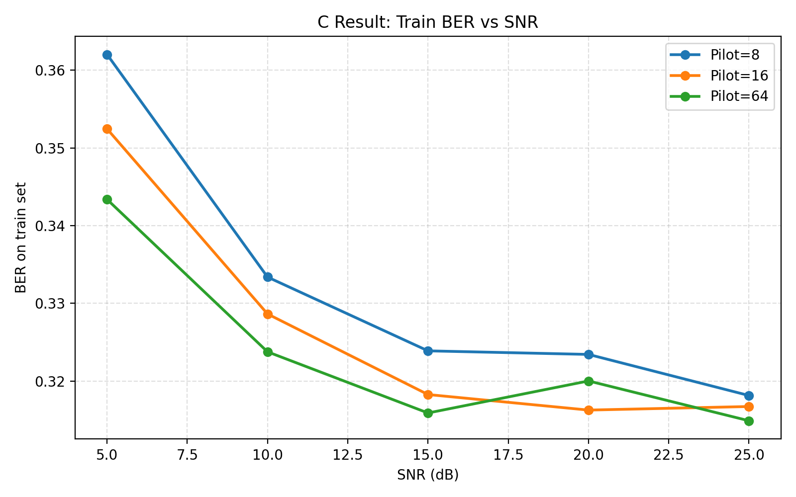
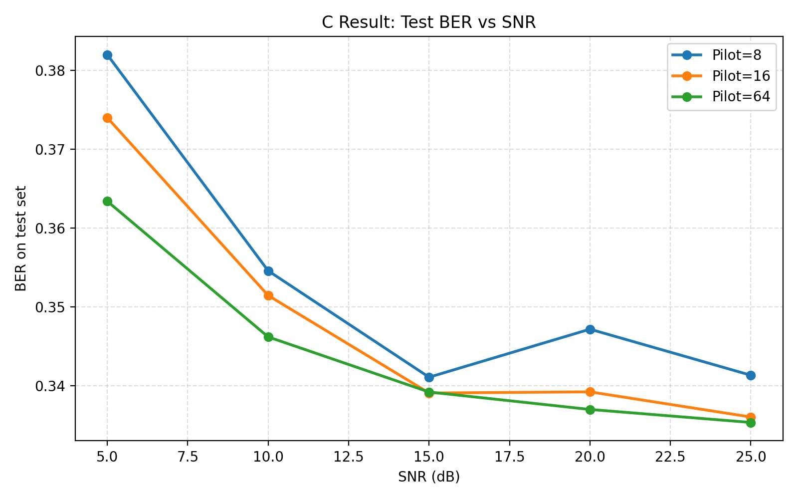

# Exercise 3.1(c) — 64-QAM FC-DNN Detection Result Analysis

This README summarizes the modified GitHub implementation and the simulation results for **Exercise 3.1(c)**. In this part, the modulation scheme is changed from **QPSK** to **64-QAM**, while other OFDM system settings remain unchanged.

---

## 1. Objective

The purpose of this experiment is to repeat the DNN-based OFDM signal detection simulation after changing the modulation from QPSK to 64-QAM. Compared with QPSK, 64-QAM carries more bits per subcarrier but has a denser constellation, so the bit detection problem becomes more difficult.

The experiment evaluates the BER performance under different SNR and pilot settings:

```python
snr_list = [5, 10, 15, 20, 25]
pilot_list = [8, 16, 64]
```

For each setting, one FC-DNN is trained and tested. The final BER values are recorded for both training and testing datasets.

---

## 2. OFDM and DNN Configuration

### OFDM settings

| Parameter | Value |
|---|---:|
| Number of subcarriers | 64 |
| Cyclic prefix length | 16 |
| Modulation | 64-QAM |
| Bits per subcarrier | 6 |
| Bits per OFDM data symbol | 64 × 6 = 384 |
| Pilot settings | 8, 16, 64 |
| SNR settings | 5, 10, 15, 20, 25 dB |

For 64-QAM, each subcarrier carries:

```text
log2(64) = 6 bits
```

Therefore, one OFDM data symbol contains:

```text
64 subcarriers × 6 bits = 384 bits
```

The original DNN-based receiver divides the whole bit vector into 8 parts. Therefore, each FC-DNN predicts:

```text
384 / 8 = 48 bits
```

---

## 3. Code Modifications

The original code is mainly designed for QPSK detection. The following modifications were applied for the 64-QAM case.

### 3.1 Change modulation order in `Train.py`

Original QPSK setting:

```python
mu = 2
```

Modified 64-QAM setting:

```python
mu = 6
```

This changes the number of transmitted bits per OFDM symbol from 128 bits to 384 bits.

---

### 3.2 Change FC-DNN output size in `Train.py`

Original QPSK output size:

```python
n_output = 16
```

Modified 64-QAM output size:

```python
n_output = 48
```

The resulting FC-DNN architecture becomes:

```text
256 → 500 → 250 → 120 → 48
```

where:

| Layer | Size | Meaning |
|---|---:|---|
| Input | 256 | Real and imaginary parts of received pilot and data OFDM symbols |
| Hidden 1 | 500 | Fully connected + ReLU |
| Hidden 2 | 250 | Fully connected + ReLU |
| Hidden 3 | 120 | Fully connected + ReLU |
| Output | 48 | Predicted bit segment for 64-QAM |

---

### 3.3 Change prediction range in `Main.py`

Original QPSK example:

```python
config.pred_range = np.arange(16, 32)
```

Modified 64-QAM setting:

```python
config.pred_range = np.arange(48, 96)
```

This makes the target label dimension equal to 48 bits, which matches `n_output = 48`.

---

### 3.4 Training parameter modification

Last question's training configuration:

```python
traing_epochs = 100
total_batch = 5
for index_k in range(0, 500):
```

Seems not enough for  64-QAM moudulation, so adjust training parameter :

```python
traing_epochs = 300
total_batch = 10
for index_k in range(0, 500):
```

Thus, each SNR/pilot case uses approximately:

```text
300 epochs × 10 batches × 500 samples = 1,500,000 training samples
```


## 4. Results

### 4.1 Train BER vs SNR



### 4.2 Test BER vs SNR



---

## 5. Recorded BER Values

### Test BER

| SNR (dB) | Pilot = 8 | Pilot = 16 | Pilot = 64 |
|---:|---:|---:|---:|
| 5  | 0.381958 | 0.373979 | 0.363396 |
| 10 | 0.354583 | 0.351458 | 0.346208 |
| 15 | 0.341104 | 0.339104 | 0.339229 |
| 20 | 0.347188 | 0.339250 | 0.337021 |
| 25 | 0.341354 | 0.336063 | 0.335375 |

### Train BER

| SNR (dB) | Pilot = 8 | Pilot = 16 | Pilot = 64 |
|---:|---:|---:|---:|
| 5  | 0.362042 | 0.352458 | 0.343375 |
| 10 | 0.333375 | 0.328625 | 0.323750 |
| 15 | 0.323875 | 0.318250 | 0.315875 |
| 20 | 0.323417 | 0.316250 | 0.320000 |
| 25 | 0.318125 | 0.316708 | 0.314875 |

---

## 6. Result Analysis

### 6.1 BER decreases as SNR increases

For all pilot settings, the BER generally decreases as SNR increases from 5 dB to 25 dB. This indicates that the FC-DNN receiver is learning useful signal detection behavior under the 64-QAM OFDM setting.

For example, in the test set:

| Pilot length | BER at 5 dB | BER at 25 dB | Absolute improvement |
|---:|---:|---:|---:|
| 8  | 0.381958 | 0.341354 | 0.040604 |
| 16 | 0.373979 | 0.336063 | 0.037917 |
| 64 | 0.363396 | 0.335375 | 0.028021 |

The improvement is most obvious from 5 dB to 15 dB. After 15 dB, the BER reduction becomes smaller, which suggests that the model performance begins to saturate under the current training configuration.

---

### 6.2 More pilots generally improve BER

At most SNR values, using more pilots gives lower BER. This is consistent with the expected OFDM behavior: more pilot information helps the DNN infer the channel effect more accurately.

For example, at 25 dB test BER:

| Pilot length | Test BER |
|---:|---:|
| 8  | 0.341354 |
| 16 | 0.336063 |
| 64 | 0.335375 |

The `Pilot = 64` case gives the best result, while `Pilot = 8` gives the worst result. However, the difference between `Pilot = 16` and `Pilot = 64` becomes small at high SNR. This suggests that when the noise level is low, pilot length becomes less dominant than the difficulty of detecting dense 64-QAM constellation points.

---

### 6.3 Train and test BER are close

The train BER is consistently lower than the test BER, but the gap is not large. The average test-train BER gap is around 0.021.

This means the model is learning from the training data, but there is no severe overfitting. If the model were heavily overfitted, the training BER would be much lower than the testing BER.

---

### 6.4 64-QAM is harder than QPSK

Compared with the QPSK result in part (b), the BER values in this 64-QAM experiment are much higher. This is reasonable because 64-QAM has a denser constellation and smaller Euclidean distance between neighboring constellation points.

Therefore, even if the SNR increases, the receiver still needs a more accurate decision boundary to distinguish between nearby 64-QAM symbols. This explains why the BER remains around 0.33 to 0.38 in the test set after 300 epochs.

---

## 7. Discussion

The result shows that the modified FC-DNN can be extended from QPSK to 64-QAM by increasing both the modulation order and output dimension. However, the BER performance is significantly worse than QPSK because the detection task becomes harder.

The current result is reasonable as an initial reproduction with reduced training complexity. To further improve the BER, the following improvements may be considered:

1. Increase the training epochs.
2. Increase `total_batch` or batch sample count.
3. Use a larger DNN, such as `256 → 1024 → 512 → 256 → 48`.
4. Verify that the `Modulation(bits, mu)` function implements true 64-QAM mapping when `mu = 6`.
5. Train all eight DNN segments and evaluate the full 384-bit OFDM data vector.
6. Use a fixed random seed to make different SNR/pilot cases more reproducible.

Overall, the experiment confirms that the learning-based OFDM receiver can be adapted to higher-order modulation, but higher-order modulation requires more careful training and model design.
---


