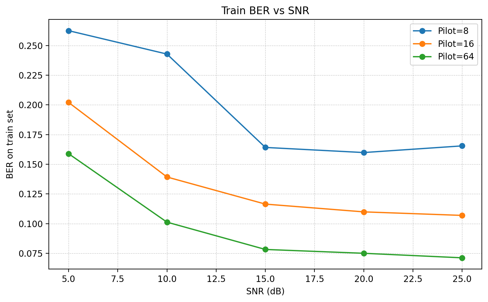
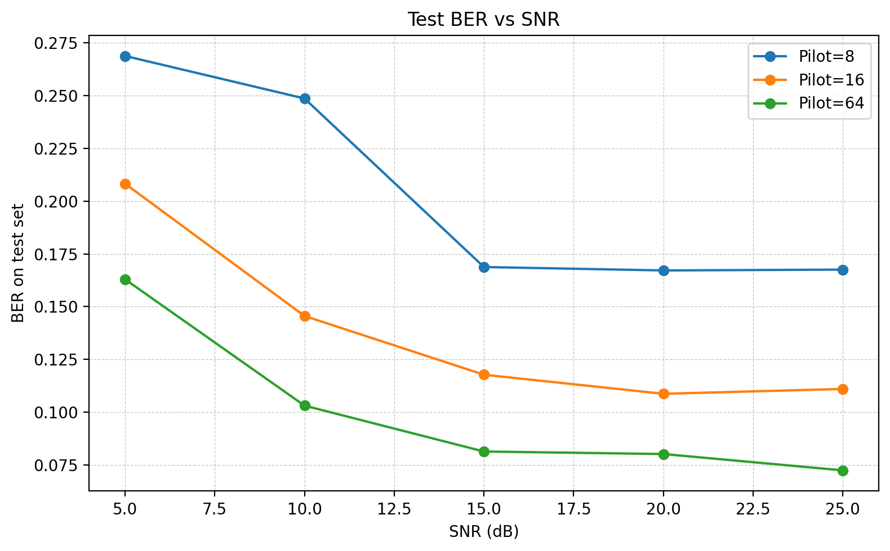

# Exercise 3.1(d) — Single Large FC-DNN for OFDM Signal Detection

This README summarizes the implementation changes and simulation results for **Exercise 3.1(d)**.  
The goal of this part is to replace the original eight smaller FC-DNN detectors with **one larger FC-DNN** that predicts the complete QPSK OFDM data symbol at once.

---

## 1. Objective

In the original FC-DNN receiver, the 128 transmitted QPSK bits of one OFDM data symbol are divided into 8 groups. Each DNN predicts only 16 bits.

For part (d), the detector is modified as follows:

- Original method: 8 FC-DNNs, each outputting 16 bits.
- Modified method: 1 large FC-DNN, outputting all 128 bits.

Because QPSK carries 2 bits per subcarrier and the OFDM system has 64 subcarriers:

```text
64 subcarriers × 2 bits/subcarrier = 128 bits
```

Therefore, the single FC-DNN must output 128 bits.

---

## 2. Main Code Modifications

### 2.1 `Train.py`

The modulation order remains QPSK:

```python
mu = 2
```

The output dimension of the FC-DNN is changed from 16 to 128:

```python
n_output = 128
```

This means that the network predicts the entire OFDM data bit vector instead of only one 16-bit segment.

If a larger hidden-layer structure is used, the network can be configured as:

```python
n_hidden_1 = 1024
n_hidden_2 = 512
n_hidden_3 = 256
n_input = 256
n_output = 128
```

The input dimension is still 256 because the DNN input consists of the real and imaginary parts of the received pilot OFDM block and the received data OFDM block:

```text
64 real pilot samples + 64 imag pilot samples
+ 64 real data samples + 64 imag data samples
= 256 input features
```

---

### 2.2 `Main.py`

The prediction range is changed to cover all 128 QPSK data bits:

```python
config.pred_range = np.arange(0, 128)
```

For BER-vs-SNR evaluation, the following SNR and pilot settings were used:

```python
snr_list = [5, 10, 15, 20, 25]
pilot_list = [8, 16, 64]
```

---

## 3. Training Parameters

The following training parameters were used:

```python
traing_epochs = 500
total_batch = 10
for index_k in range(0, 1000):
```

Therefore, each SNR/pilot setting uses approximately:

```text
500 epochs × 10 batches/epoch × 1000 samples/batch
= 5,000,000 training samples
```

This training budget is larger than the preliminary setting used during debugging and is more suitable for the single large DNN, because predicting 128 bits simultaneously is a harder learning problem than predicting only 16 bits per network.

---

## 4. Results

### 4.1 Train BER



### 4.2 Test BER



---

## 5. Result Summary

Approximate final BER values observed from the plotted results are summarized below.

### 5.1 Train BER

| SNR (dB) | Pilot = 8 | Pilot = 16 | Pilot = 64 |
|---:|---:|---:|---:|
| 5  | 0.262 | 0.202 | 0.159 |
| 10 | 0.243 | 0.139 | 0.101 |
| 15 | 0.164 | 0.117 | 0.079 |
| 20 | 0.160 | 0.110 | 0.075 |
| 25 | 0.166 | 0.107 | 0.071 |

### 5.2 Test BER

| SNR (dB) | Pilot = 8 | Pilot = 16 | Pilot = 64 |
|---:|---:|---:|---:|
| 5  | 0.268 | 0.208 | 0.163 |
| 10 | 0.249 | 0.146 | 0.103 |
| 15 | 0.169 | 0.118 | 0.081 |
| 20 | 0.168 | 0.109 | 0.080 |
| 25 | 0.168 | 0.111 | 0.073 |

---

## 6. Analysis

### 6.1 Effect of SNR

For all pilot settings, the BER generally decreases as SNR increases. This confirms that the single large FC-DNN is learning a meaningful detection function rather than producing random outputs.

The improvement is especially clear from 5 dB to 15 dB. For example, with 64 pilots, the test BER decreases from about 0.163 at 5 dB to about 0.081 at 15 dB.

At higher SNR values, the BER improvement becomes smaller. This indicates that the performance is no longer limited only by noise. Other factors, such as pilot information, model capacity, and optimization difficulty, also affect the final BER.

---

### 6.2 Effect of Pilot Number

The number of pilots has a strong influence on BER.

For the same SNR, the result follows the expected order:

```text
Pilot = 64  <  Pilot = 16  <  Pilot = 8
```

where a smaller BER is better.

This behavior is reasonable because more pilots provide more channel-related information to the DNN. With 64 pilots, the network can infer the channel condition more reliably, leading to lower BER. With only 8 pilots, the channel information is limited, so the BER remains higher and saturates at high SNR.

---

### 6.3 Train BER vs Test BER

The train BER is slightly lower than the test BER in most cases, but the difference is not large. This suggests that the model does not show severe overfitting.

For example, at SNR = 25 dB and Pilot = 64:

```text
Train BER ≈ 0.071
Test BER  ≈ 0.073
```

The close values indicate that the trained model generalizes reasonably well to the testing channel samples.

---

### 6.4 Comparison with the Eight-DNN Method

Compared with the original eight-DNN approach, the single large DNN is harder to train. In the original approach, each DNN only predicts 16 bits, while in this part, one DNN predicts all 128 bits at once.

This increases the output dimension and makes the optimization problem more difficult. Therefore, even though the single DNN can simplify deployment, its BER may be slightly worse than the eight-DNN structure unless the model capacity and training data are increased.

The results show that the single large DNN still works, especially for larger pilot numbers. However, the higher BER for Pilot = 8 shows that the single-DNN architecture is more sensitive to insufficient pilot information.

---

### 6.5 High-SNR Saturation

For Pilot = 8, the test BER decreases from 5 dB to 15 dB, but then stays around 0.168 from 15 dB to 25 dB. This saturation means that increasing SNR alone is not enough to further improve performance when the number of pilots is too small.

For Pilot = 16, the BER also slightly saturates at high SNR. In contrast, Pilot = 64 continues to show the best and most stable performance.

Possible reasons include:

1. Limited pilot information for channel inference.
2. Larger output dimension of the single FC-DNN.
3. Optimization difficulty when predicting 128 bits jointly.
4. Remaining stochastic variation from random channel and bit generation.

---

## 7. Conclusion

The single large FC-DNN receiver successfully learns to detect the full 128-bit QPSK OFDM data symbol. The simulation results show the expected trends:

- BER decreases as SNR increases.
- BER decreases as the number of pilots increases.
- Pilot = 64 gives the best performance.
- Train and test BER are close, indicating acceptable generalization.

However, compared with the original eight-DNN structure, the single large DNN is more difficult to train because it predicts a much larger output vector. Therefore, it requires a larger network, more training samples, and possibly a better loss function such as binary cross-entropy to further improve BER.

Overall, the result supports the conclusion that a single large FC-DNN can replace the eight smaller DNNs, but there is a tradeoff between architectural simplicity and detection performance.

---


